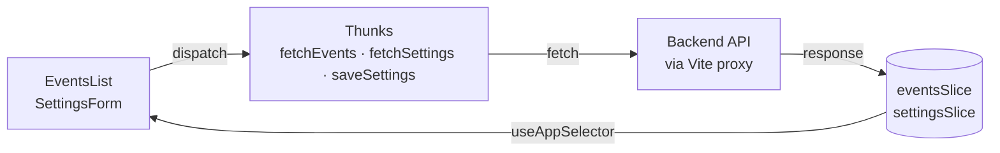

# Eventim Frontend Test

Welcome to the Eventim frontend test for new hires (Mid Level). The purpose of this test is to build a React UI that integrates with the backend API.

## Tech Stack

- Node 22
- React 18 + TypeScript
- Vite
- MUI (Material UI v5)
- Redux Toolkit
- Formik + Yup

All dependencies are already installed — no need to add them.

## Requirements

- NVM (to switch to the correct Node version)
- The backend API must be running on `http://localhost:3000` before you start the frontend

## Setup

1. Fork this repository into your own GitHub account
2. Clone the fork to your machine
3. Run `nvm use` to switch to the correct Node version
4. Run `yarn install` to install dependencies
5. Run `yarn dev` to start the development server

The Vite dev server proxies `/events` and `/settings` to the backend automatically, so no extra configuration is needed.

## Tasks

### 1. Events list

Consume `GET /events` from the backend and display the list of events. Each event should show its relevant information.

- Use MUI components to build the UI
- The layout should be responsive
- Use Redux to manage the events state

### 2. Settings form

Build a form that reads and updates a settings object via the backend API (`GET /settings` and `POST /settings`).

- Use MUI components to build the form
- The layout should be responsive
- Use Redux to manage the settings state
- Use Formik for the form and Yup for validation

---

# Implementation

Two views behind MUI tabs. No router is installed and the brief rules out new dependencies, so tabs stand in for routes; both panels stay mounted, so switching does not refetch.

## Events

A responsive card grid — one column on phones, two on tablets, three on desktop — showing name, date, location, description and a chip with the number of tickets still available.

Paging metadata is stored from the response rather than from what was requested, so a page the server clamped is reflected in the controls. Only the first load shows a spinner: later page changes keep the current page visible at reduced opacity so the layout does not jump. A failed request renders a retry action instead of an empty screen.

## Settings

A Formik form validated by a Yup schema that mirrors the rules the API enforces, so the user is told what is wrong before a round trip — the server still validates, this is convenience rather than trust.

The form reinitialises once the request resolves, since the initial values only arrive after the first render, and it stores the response rather than the submitted values so it never diverges from what was actually persisted. A rejected save surfaces the API's own message, which lists every invalid field.

## Data flow

Thunks call relative paths on purpose: the Vite dev server proxies `/events` and `/settings` to the API, and an absolute URL would bypass the proxy and trigger CORS.

## Note on the API contract

`GET /events` is consumed as a paginated envelope (`data`, `page`, `pageSize`, `total`, `totalPages`), and each event carries `availableTicketsCount` rather than the full ticket rows. This matches the backend in the companion repository.
